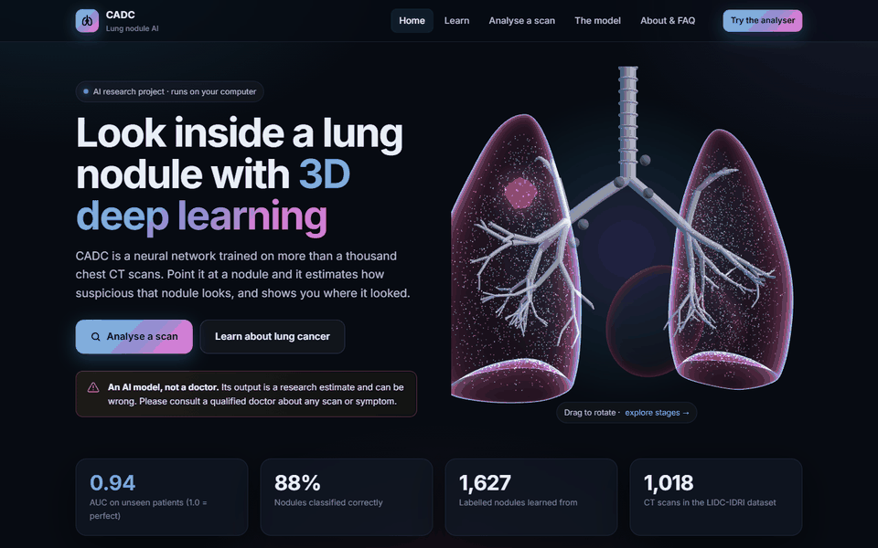
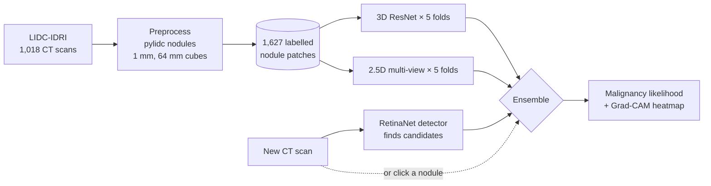

# CADC: AI for lung nodule analysis on CT

**CADC** (computer-aided detection and characterisation) is an end-to-end deep-learning project that
**finds lung nodules in chest CT scans and estimates how suspicious they look**. It uses an ensemble of
two neural networks trained on the public LIDC-IDRI dataset, and a local web app with a 3D lung model,
explainability heatmaps and an AI assistant.



> [!WARNING]
> **Research project, not a medical device.** CADC has not been clinically validated. Its models learned
> radiologists' *opinions* about nodules, not biopsy results, and they can be wrong. Nothing here is a
> diagnosis. Anyone with a health concern should see a qualified doctor.

---

## Contents

- [What's been built](#whats-been-built)
- [Results](#results)
- [How it works](#how-it-works)
- [The web app](#the-web-app)
- [Quick start (Windows)](#quick-start-windows)
- [Running on Google Colab](#running-on-google-colab)
- [Command reference](#command-reference)
- [Project structure](#project-structure)
- [Limitations](#limitations)
- [Troubleshooting](#troubleshooting)
- [Ideas for future work](#ideas-for-future-work)
- [Credits and licences](#credits-and-licences)

---

## What's been built

| Area | What was done |
|---|---|
| **Data pipeline** | Downloaded all 1,018 LIDC-IDRI CT scans (~125 GB) from The Cancer Imaging Archive, one at a time. For each one, pylidc groups the radiologists' annotations into nodules, and the pipeline saves a 64 mm cube (1 mm voxels) around every nodule, then deletes the raw scan. The result is **0.9 GB of patches** instead of 125 GB. It resumes after interruptions, and ran on Google Colab. |
| **Labels** | Up to 4 radiologists rated each nodule 1–5. The mean rating gives the label: ≤ 2.5 benign, ≥ 3.5 malignant, ambiguous nodules in between left out. That leaves **1,627 nodules from 724 patients (504 malignant)**. |
| **Model 1: 3D ResNet** | A 3D convolutional network (8.3 M parameters) trained from scratch on 48³ mm cubes. |
| **Model 2: 2.5D multi-view CNN** | Cuts 9 planes through each nodule (3 orthogonal, 6 diagonal), reads them with one shared ImageNet-pretrained ResNet18, and pools the results (11.2 M parameters). |
| **Ensemble** | Averages all 10 networks (5 folds × 2 architectures). |
| **Honest evaluation** | 5-fold cross-validation **split by patient**, with scores from the final epoch (not the best one), 95% bootstrap confidence intervals, and nodule- and patient-level metrics. An overfitting check compares training and unseen-patient scores and learning curves. |
| **Real-diagnosis test** | Tested the models against the 118 LIDC patients whose diagnosis was **confirmed** (biopsy, surgery, 2-year stability or progression), compared with the radiologists' own ratings. |
| **Automatic detection** | Integrated MONAI's pretrained LUNA16 RetinaNet so the app **finds nodules itself** across a whole scan, then scores each one with the ensemble. |
| **Explainability** | Grad-CAM "AI attention" heatmaps show which regions pushed the 3D models towards "malignant". |
| **Web app** | Five pages: Home, Learn, Analyse, Model and About. Includes an interactive **Three.js 3D lung model** that shows cancer stages 0–IV, interactive charts, printable reports, a mandatory AI disclaimer, and dark design that works on phones. |
| **AI assistant** | A chat assistant (Groq API) on every page. It explains nodules, lung cancer and the results, and is instructed never to diagnose and to put emergency advice first. |
| **Training infrastructure** | Resumable training with mixed precision. Runs on a 6 GB laptop GPU (RTX 4050) or Google Colab; Colab can be driven from Claude Code through the Colab MCP server. |

---

## Results

All numbers are from **5-fold cross-validation split by patient**: every nodule is scored only by
models that never saw that patient during training.

| Model | AUC vs radiologist ratings (95% CI) | Accuracy | Sensitivity | Specificity | Patient-level AUC | AUC vs confirmed diagnosis |
|---|---|---|---|---|---|---|
| 3D ResNet | 0.924 (0.907–0.939) | 86.7% | 83.9% | 87.9% | 0.933 | 0.66 |
| 2.5D multi-view | 0.931 (0.916–0.944) | 86.4% | 83.3% | 87.8% | 0.929 | 0.71 |
| **Ensemble (10 networks)** | **0.936 (0.921–0.949)** | **88.3%** | **84.9%** | **89.8%** | **0.941** | 0.68 |
| *Radiologists' own ratings* | – | – | – | – | – | *0.77* |

*AUC: 0.5 = guessing, 1.0 = perfect. Accuracy, sensitivity and specificity use a 50% threshold.*

**What the results mean**

1. **The models predict radiologists' opinions well.** The ensemble reaches AUC 0.936, better than either
   model alone and within the 0.85–0.95 range usually reported for this dataset.
2. **Predicting actual cancer is much harder.** On 118 patients with confirmed diagnoses, every model drops to
   AUC ≈ 0.66–0.71, below the radiologists' own ratings (0.77). The models learned to imitate ratings, not
   pathology, and many of these patients had metastases from other cancers. With so few patients the
   uncertainty is about ±0.12, so the three models can't be ranked on this test. **This is the project's most
   important limitation.**
3. **No overfitting.** Training and unseen-patient AUC differ by only ~0.02, and validation AUC never falls
   late in training. The 3D model was still slightly improving at epoch 60.
4. **Detection works on a spot check.** The pretrained detector found 14 of 17 radiologist-marked nodules
   on 3 scans, within a few millimetres of their centres. It was trained on LUNA16, which is drawn from LIDC-IDRI,
   so this is not an independent test.

---

## How it works



**Preprocessing** ([cadc/preprocess.py](cadc/preprocess.py))
- Reads each scan's slices and converts them to Hounsfield units.
- pylidc clusters the 4 radiologists' outlines into nodules.
- Crops a cube around each nodule's centre, resamples it to 1 mm isotropic voxels, and clips it to −1000…400 HU.

**Training** ([cadc/train.py](cadc/train.py))
- Random 48³ crops, flips and 90° rotations for augmentation.
- AdamW optimiser, cosine learning rate, class-balanced loss, mixed precision, 60 epochs.
- A checkpoint every epoch, so interrupted runs resume where they stopped.

**The two architectures** ([cadc/model.py](cadc/model.py))
- **3D ResNet:** four stages of residual blocks (32→64→128→256 filters) → global pooling → one logit. It sees the nodule's true 3D shape.
- **2.5D multi-view:** 9 planes through the nodule centre, each upscaled to 96 px and passed through an ImageNet-pretrained ResNet18. The mean and max of the features give one logit. Pretraining makes it learn fast; it reaches its best within ~10 epochs.

**Evaluation**
- **Patient-grouped folds:** all nodules of a patient stay in one fold, so no model is tested on a patient it trained on.
- **Final-epoch predictions:** choosing the "best" epoch would peek at the test fold.
- **Ensembling:** the ensemble averages out-of-fold predictions; both models use the same folds, so this stays honest.

**Detection** ([cadc/detect.py](cadc/detect.py))
- The volume is reoriented to RAS, resampled to 0.70 × 0.70 × 1.25 mm, and scanned with a sliding window.
- Boxes are mapped back to slice coordinates.
- Each candidate is then cropped and scored by the ensemble.

---

## The web app

A local website served by FastAPI. Scans are processed **on your computer** and are never uploaded.

| Page | What's there |
|---|---|
| **Home** | Overview, live headline results, a rotating 3D model of the lungs. |
| **Learn** | A **3D explorer**: click labelled parts (trachea, bronchi, lobes, alveoli, lymph nodes), and switch between healthy lungs and stages I–IV to watch a tumour grow, reach the lymph nodes and spread. The page also covers what lung cancer is, its types, risk factors, symptoms, lung nodules, staging with survival rates, screening, diagnosis, treatment, prevention, and **when to see a doctor**. |
| **Analyse a scan** | Upload a chest CT (a `.zip` of DICOM files, or the `.dcm` files) or try a sample. Then either click **Find nodules automatically** or click a nodule yourself. You get:<br>• a likelihood gauge with a low / intermediate / high band<br>• every network's vote<br>• CT views of the region the models saw, and the **AI attention** heatmap<br>• a **printable report** and an **Ask AI about this result** button |
| **The model** | Headline metrics, interactive ROC and learning curves, model comparison, the real-diagnosis test, per-fold results, architecture and limitations. |
| **About & FAQ** | Full medical disclaimer, privacy notes, FAQ, credits. |

**Safety built in**
- **First-visit disclaimer on every page**, which must be accepted before continuing: it's an AI, not a diagnosis, consult a doctor. The analyser stays locked until it's accepted.
- **A warning banner and "what to do next" doctor advice** on every result.
- **Scores from training scans are flagged as optimistic.**
- **A medical disclaimer in every footer.**
- **The AI assistant** is instructed never to diagnose and to direct emergencies to 112 / 911.

---

## Quick start (Windows)

Tested on Windows 11 with Python 3.11 and an RTX 4050 laptop GPU (6 GB). Uses [uv](https://docs.astral.sh/uv/).

**1. Install**
```
git clone https://github.com/Dhir-learner/CAD-C.git
cd CAD-C
uv venv --python 3.11 .venv
uv pip install -r requirements.txt -r requirements-app.txt
uv pip install torch torchvision --index-url https://download.pytorch.org/whl/cu126
.venv\Scripts\python -c "import torch; print(torch.cuda.is_available())"
```
The last line must print `True` to use the GPU.

**2. Get the data** (~125 GB is downloaded, streamed one scan at a time; ~0.9 GB is kept)
```
.venv\Scripts\python -m cadc.preprocess --out data\patches --work data\dicom
```
This takes a few hours at home; on Colab it took about 2 hours (see below). If you already have
`patches.zip`, unzip it so the `.npz` files sit in `data\patches\` instead.

For the real-diagnosis test, also download the diagnosis spreadsheet:
```
curl -L --create-dirs -o data\meta\diagnosis.xls https://www.cancerimagingarchive.net/wp-content/uploads/tcia-diagnosis-data-2012-04-20.xls
```

**3. Train and evaluate everything**

Double-click **`train_local.bat`**. It:
- trains both architectures on all 5 folds (about 2 hours on an RTX 4050),
- evaluates each one,
- runs the real-diagnosis test,
- builds the ensemble.

Results go to `runs\ensemble\`. If it's interrupted, run it again and it resumes.

**4. Optional: automatic nodule detection** (about 160 MB)
```
.venv\Scripts\python -c "from monai.bundle import download; download(name='lung_nodule_ct_detection', bundle_dir='data/bundles')"
```

**5. Optional: the AI assistant.** Get a free key at [console.groq.com](https://console.groq.com/keys) and create a file called `.env` in the project folder:
```
GROQ_API_KEY=your-key-here
```
`.env` is git-ignored. **Never commit the key**; this repository is public.

**6. Run the web app.** Double-click **`run_app.bat`**. The browser opens at http://127.0.0.1:8000 once the models are loaded. Keep the black window open while you use it.

---

## Running on Google Colab

Colab is useful for the long preprocessing download and for training without a local GPU. Open
[`notebooks/colab_launcher.ipynb`](https://colab.research.google.com/github/Dhir-learner/CAD-C/blob/main/notebooks/colab_launcher.ipynb) and run the cells in order:

1. **Setup:** mounts Google Drive, clones this repo, installs packages. Run it again after every reconnect.
2. **Preprocess:** use a *CPU* runtime; it needs no GPU and uses no GPU quota. Patches are saved to `MyDrive/CADC/patches/`.
3. **Train:** switch to a *T4 GPU* runtime, copy the patches to local disk, and train the folds (add `--arch multiview2d` for the second model).
4. **Evaluate and predict.**

Every step resumes after a disconnect: rerun Setup and the step you were on. Keep the tab open and the PC awake.
The free tier's GPU quota is enough, since training resumes across sessions.

This project's preprocessing was run on Colab and driven from Claude Code through Google's
[Colab MCP server](https://github.com/googlecolab/colab-mcp) (configured in `.mcp.json`).

---

## Command reference

| Command | What it does |
|---|---|
| `python -m cadc.preprocess --out DIR --work TMP [--limit N]` | Download scans and save nodule patches (resumable). |
| `python -m cadc.train --data DIR --out RUN --fold K [--arch resnet3d\|multiview2d]` | Train one fold. Other options: `--epochs`, `--batch-size`, `--lr`, `--min-readers 3` (stricter labels). |
| `python -m cadc.evaluate --run RUN [--which final\|best]` | Pool the folds: AUC with CI, accuracy, sensitivity, specificity, ROC → `metrics.json`, `roc.png`. |
| `python -m cadc.ensemble --runs RUN1 RUN2 --out DIR` | Average runs' out-of-fold predictions and compare → `comparison.json`. |
| `python -m cadc.diagnosis_eval --runs RUN... --data DIR --diagnosis XLS` | Test against confirmed diagnoses next to the radiologists' ratings. |
| `python -m cadc.predict --run RUN --shard FILE.npz` | Score the nodules of a preprocessed scan. |
| `python -m cadc.predict --run RUN --dicom DIR --center X Y SLICE` | Score a nodule in a new CT scan (column, row, slice from the bottom; 0-based). |
| `python -m app.server [--run RUN...] [--port 8000] [--no-browser]` | Start the web app (`run_app.bat` does this). |
| `uv run --no-project --with playwright --with pillow python docs/make_demo_gif.py` | Re-record `docs/demo.gif` (needs the app running on port 8765). |

---

## Project structure

```
CAD-C/
├── cadc/                      # the machine-learning package
│   ├── preprocess.py          # TCIA download → pylidc nodules → 64 mm patches (.npz per scan)
│   ├── data.py                # label rule, patient-grouped folds, augmentation
│   ├── model.py               # 3D ResNet and 2.5D multi-view CNN
│   ├── train.py               # resumable training of one fold
│   ├── evaluate.py            # pooled out-of-fold metrics and ROC
│   ├── ensemble.py            # combine runs, compare models
│   ├── diagnosis_eval.py      # test against confirmed diagnoses
│   ├── detect.py              # MONAI RetinaNet nodule detection
│   └── predict.py             # score nodules from a shard or DICOM folder
├── app/                       # the web app
│   ├── server.py              # FastAPI: pages, upload, predict, Grad-CAM, detect, metrics, chat
│   ├── chat.py                # Groq assistant: safety prompt, real results, streaming
│   └── static/                # 5 HTML pages, css/, js/ (3D lungs, charts, analyser, chat), vendor/three.js
├── notebooks/colab_launcher.ipynb
├── docs/                      # demo.gif and the script that records it
├── train_local.bat            # one-click: train both models, evaluate, ensemble, diagnosis test
├── run_app.bat                # one-click: start the web app
├── requirements.txt           # ML pipeline
├── requirements-app.txt       # web app, detection, assistant
└── .mcp.json                  # Colab MCP server config (for driving Colab from Claude Code)

Not in git (large or private):
├── data/patches/              # 1,018 .npz shards (~0.9 GB)
├── data/meta/diagnosis.xls    # LIDC confirmed diagnoses
├── data/bundles/              # MONAI detection bundle (~160 MB)
├── runs/                      # checkpoints and results: baseline/, multiview/, ensemble/
└── .env                       # GROQ_API_KEY
```

---

## Limitations

- **Labels are opinions.** The models predict what radiologists would rate a nodule, not whether it is cancer.
  Against confirmed diagnoses they do clearly worse (see [Results](#results)).
- **One dataset.** LIDC-IDRI comes from a handful of US institutions in the 2000s. Other scanners,
  protocols and populations may give worse results. There has been no external validation.
- **Detection is not independently tested.** The detector was trained on LUNA16 (a subset of LIDC-IDRI), and it
  can miss nodules or flag other structures.
- **No clinical context.** Doctors use growth over time, symptoms, smoking history and other tests. The models see
  one 48 mm cube from one scan.
- **Scores on LIDC scans are optimistic** in the app, because those scans were in the training data; the app says so.
- **The assistant can be wrong.** It is a general-purpose language model with instructions, not a medical source.

---

## Troubleshooting

| Problem | Fix |
|---|---|
| The web page looks unstyled (plain text) | Press **Ctrl+F5**. It was loaded before the server was ready. `run_app.bat` now waits, so this shouldn't recur. |
| `torch.cuda.is_available()` is `False` | Reinstall the GPU build: `uv pip install torch torchvision --index-url https://download.pytorch.org/whl/cu126 --reinstall-package torch`. |
| `CUDA out of memory` | Lower `--batch-size` (16 for the 3D model on a 6 GB GPU). |
| `ModuleNotFoundError: pkg_resources` | `uv pip install "setuptools<81"` (pylidc still needs it). |
| "Find nodules automatically" is missing | Download the detection bundle (Quick start step 4) and restart the app. |
| Chat button is greyed out | Add `GROQ_API_KEY` to `.env` and restart the app. |
| Colab "Runtime disconnected" | Reconnect, rerun Setup and the step you were on; everything resumes. |
| Scans listed in `failed.log` | Usually a network hiccup: rerun preprocessing and only those scans are retried. |

---

## Ideas for future work

- **External validation** on a separate, pathology-confirmed dataset such as LUNGx (TCIA).
- **Stricter labels** (`--min-readers 3`) for direct comparison with published results.
- **Calibration**, so that "70%" means about 70% of such nodules are rated malignant.
- **Nodule measurements** (diameter and volume from segmentation) shown in the app.
- **Hosting** a demo online (e.g. Hugging Face Spaces) with the same disclaimers.

---

## Credits and licences

- **Data:** LIDC-IDRI, The Cancer Imaging Archive, [CC BY 3.0](https://creativecommons.org/licenses/by/3.0/).
  Please cite: Armato SG III, McLennan G, Bidaut L, et al. *The Lung Image Database Consortium (LIDC) and Image
  Database Resource Initiative (IDRI): a completed reference database of lung nodules on CT scans.* Medical Physics
  38(2):915–931, 2011. Confirmed diagnoses: TCIA `tcia-diagnosis-data-2012-04-20.xls`.
- **Detection model:** MONAI Model Zoo [`lung_nodule_ct_detection`](https://github.com/Project-MONAI/model-zoo)
  (Apache-2.0), trained on [LUNA16](https://luna16.grand-challenge.org/) (CC BY 4.0).
- **Pretrained backbone:** torchvision ResNet18 ImageNet weights.
- **Built with:** PyTorch, torchvision, MONAI, pylidc, pydicom, scikit-learn, FastAPI, Three.js, Groq API, Google Colab.
